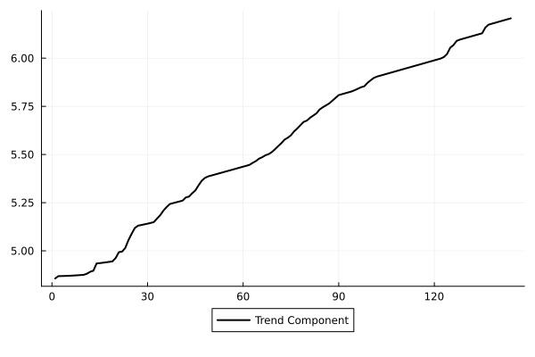
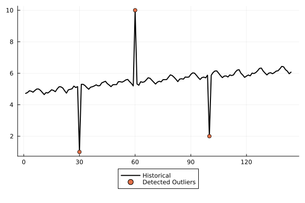

# StateSpaceLearning

| **Build Status** | **Coverage** | **Documentation** |
|:-----------------:|:-----------------:|:-----------------:|
| [](https://github.com/LAMPSPUC/StateSpaceLearning.jl/actions/workflows/ci.yml) | [](https://codecov.io/gh/LAMPSPUC/StateSpaceLearning.jl) | []( https://lampspuc.github.io/StateSpaceLearning.jl/)

StateSpaceLearning.jl is a package for modeling and forecasting time series in a high-dimension regression framework.

## Quickstart

```julia
using StateSpaceLearning

y = randn(100)

# Instantiate Model
model = StructuralModel(y)

# Fit Model
fit!(model)

# Point Forecast
prediction = StateSpaceLearning.forecast(model, 12) #Gets a 12 steps ahead prediction

# Scenarios Path Simulation
simulation = StateSpaceLearning.simulate(model, 12, 1000) #Gets 1000 scenarios path of 12 steps ahead predictions
```

## StructuralModel Arguments

* `y::Vector`: Vector of data.
* `level::Bool`: Boolean where to consider intercept in the model (default: true)
* `stochastic_level::Bool`: Boolean where to consider stochastic level component in the model (default: true)
* `trend::Bool`: Boolean where to consider trend component in the model (default: true)
* `stochastic_trend::Bool`: Boolean where to consider stochastic trend component in the model (default: true)
* `seasonal::Bool`: Boolean where to consider seasonal component in the model (default: true)
* `stochastic_seasonal::Bool`: Boolean where to consider stochastic seasonal component in the model (default: true)
* `freq_seasonal::Int`: Seasonal frequency to be considered in the model (default: 12)
* `outlier::Bool`: Boolean where to consider outlier component in the model (default: true)
* `ζ_ω_threshold::Int`: Argument to stabilize `stochastic trend` and `stochastic seasonal` components (default: 12)

## Features

Current features include:
* Estimation
* Components decomposition
* Forecasting
* Completion of missing values
* Predefined models, including:
* Outlier detection
* Outlier robust models

## Quick Examples

### Fitting, forecasting and simulating
Quick example of fit and forecast for the air passengers time-series.

```julia
using CSV
using DataFrames
using Plots

airp = CSV.File(StateSpaceLearning.AIR_PASSENGERS) |> DataFrame
log_air_passengers = log.(airp.passengers)
steps_ahead = 30

model = StructuralModel(log_air_passengers)
fit!(model)
prediction_log = StateSpaceLearning.forecast(model, steps_ahead) # arguments are the output of the fitted model and number of steps ahead the user wants to forecast
prediction = exp.(prediction_log)

plot(airp.passengers, w=2 , color = "Black", lab = "Historical", legend = :outerbottom)
plot!(vcat(ones(length(log_air_passengers)).*NaN, prediction), lab = "Forecast", w=2, color = "blue")
```


```julia
N_scenarios = 1000
simulation = StateSpaceLearning.simulate(model, steps_ahead, N_scenarios) # arguments are the output of the fitted model, number of steps ahead the user wants to forecast and number of scenario paths

plot(airp.passengers, w=2 , color = "Black", lab = "Historical", legend = :outerbottom)
for s in 1:N_scenarios-1
    plot!(vcat(ones(length(log_air_passengers)).*NaN, exp.(simulation[:, s])), lab = "", α = 0.1 , color = "red")
end
plot!(vcat(ones(length(log_air_passengers)).*NaN, exp.(simulation[:, N_scenarios])), lab = "Scenarios Paths", α = 0.1 , color = "red")

```


### Component Extraction
Quick example on how to perform component extraction in time series utilizing StateSpaceLearning.

```julia
using CSV
using DataFrames
using Plots

airp = CSV.File(StateSpaceLearning.AIR_PASSENGERS) |> DataFrame
log_air_passengers = log.(airp.passengers)

model = StructuralModel(log_air_passengers)
fit!(model)

level = model.output.components["μ1"]["Values"] + model.output.components["ξ"]["Values"]
slope = model.output.components["ν1"]["Values"] + model.output.components["ζ"]["Values"]
seasonal = model.output.components["γ1"]["Values"] + model.output.components["ω"]["Values"]
trend = level + slope

plot(trend, w=2 , color = "Black", lab = "Trend Component", legend = :outerbottom)
plot(seasonal, w=2 , color = "Black", lab = "Seasonal Component", legend = :outerbottom)

```

|  | |
|:------------------------------:|:-----------------------------:|


### Best Subset Selection
Quick example on how to perform best subset selection in time series utilizing StateSpaceLearning.

```julia
using StateSpaceLearning
using CSV
using DataFrames
using Random

Random.seed!(2024)

airp = CSV.File(StateSpaceLearning.AIR_PASSENGERS) |> DataFrame
log_air_passengers = log.(airp.passengers)
X = rand(length(log_air_passengers), 10) # Create 10 exogenous features 
β = rand(3)

y = log_air_passengers + X[:, 1:3]*β # add to the log_air_passengers series a contribution from only 3 exogenous features.

model = StructuralModel(y; Exogenous_X = X)
fit!(model; α = 1.0, information_criteria = "bic", ϵ = 0.05, penalize_exogenous = true, penalize_initial_states = true)

Selected_exogenous = model.output.components["Exogenous_X"]["Selected"]

```

In this example, the selected exogenous features were 1, 2, 3, as expected.

### Missing values imputation
Quick example of completion of missing values for the air passengers time-series (artificial NaN values are added to the original time-series).

```julia
using CSV
using DataFrames
using Plots

airp = CSV.File(StateSpaceLearning.AIR_PASSENGERS) |> DataFrame
log_air_passengers = log.(airp.passengers)

airpassengers = Float64.(airp.passengers)
log_air_passengers[60:72] .= NaN

model = StructuralModel(log_air_passengers)
fit!(model)

fitted_completed_missing_values = ones(144).*NaN; fitted_completed_missing_values[60:72] = exp.(model.output.fitted[60:72])
real_removed_valued = ones(144).*NaN; real_removed_valued[60:72] = deepcopy(airp.passengers[60:72])
airpassengers[60:72] .= NaN

plot(airpassengers, w=2 , color = "Black", lab = "Historical", legend = :outerbottom)
plot!(real_removed_valued, lab = "Real Removed Values", w=2, color = "red")
plot!(fitted_completed_missing_values, lab = "Fit in Sample completed values", w=2, color = "blue")

```


### Outlier Detection
Quick example of outlier detection for an altered air passengers time-series (artificial NaN values are added to the original time-series).

```julia
using CSV
using DataFrames
using Plots

airp = CSV.File(StateSpaceLearning.AIR_PASSENGERS) |> DataFrame
log_air_passengers = log.(airp.passengers)

log_air_passengers[60] = 10
log_air_passengers[30] = 1
log_air_passengers[100] = 2

model = StructuralModel(log_air_passengers)
fit!(model)

detected_outliers = findall(i -> i != 0, model.output.components["o"]["Coefs"])

plot(log_air_passengers, w=2 , color = "Black", lab = "Historical", legend = :outerbottom)
scatter!([detected_outliers], log_air_passengers[detected_outliers], lab = "Detected Outliers")

```


### StateSpaceModels initialization
Quick example on how to use StateSpaceLearning to initialize  StateSpaceModels

```julia
using CSV
using DataFrames
using StateSpaceModels

airp = CSV.File(StateSpaceLearning.AIR_PASSENGERS) |> DataFrame
log_air_passengers = log.(airp.passengers)

model = StructuralModel(log_air_passengers)
fit!(model)

residuals_variances = model.output.residuals_variances

ss_model = BasicStructural(log_air_passengers, 12)
set_initial_hyperparameters!(ss_model, Dict("sigma2_ε" => residuals_variances["ε"], 
                                         "sigma2_ξ" =>residuals_variances["ξ"], 
                                         "sigma2_ζ" =>residuals_variances["ζ"], 
                                         "sigma2_ω" =>residuals_variances["ω"]))
StateSpaceModels.fit!(ss_model)
```

## Paper Results Reproducibility

The paper has two experiments (results for the M4 competition and a simulation study). To reproduce each experiment follow the instructions below:

### M4 Experiment

To reproduce M4 paper results you can clone the repository and run the following commands on terminal:

```shell
julia paper_tests/m4_test/m4_test.jl
python paper_tests/m4_test/m4_test.py
```

The results for SSL model in terms of MASE and sMAPE for all 48000 series will be stored in folder "paper_tests/m4_test/results_SSL". The average results of MASE, sMAPE and OWA will be saved in file "paper_tests/m4_test/metric_results/SSL_METRICS_RESULTS.csv".

The results for SS model in terms of MASE and sMAPE for all 48000 series will be stored in folder "paper_tests/m4_test/results_SS". The average results of MASE, sMAPE and OWA will be saved in file "paper_tests/m4_test/metric_results/SS_METRICS_RESULTS.csv".

### Simulation Experiment

To reproduce the simulation results you can clone the repository and run the following commands on terminal:

```shell
julia paper_tests/simulation_test/simulation.jl 0
```

As this test takes a long time, you may want to run it in parallel, for that you can change the last argument to be number of workers to use in the parallelization:

```shell
julia paper_tests/simulation_test/simulation.jl 3
```

The results will be saved in two separated files: "paper_tests/simulation_test/results_metrics/metrics_confusion_matrix.csv" and "paper_tests/simulation_test/results_metrics/metrics_bias_mse.csv"


## Contributing

* PRs such as adding new models and fixing bugs are very welcome!
* For nontrivial changes, you'll probably want to first discuss the changes via issue.