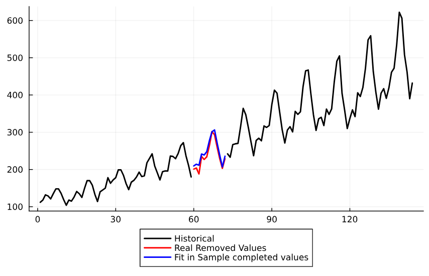

# StateSpaceLearning

| **Build Status** | **Coverage** | **Documentation** |
|:-----------------:|:-----------------:|:-----------------:|
| [](https://github.com/LAMPSPUC/StateSpaceLearning.jl/actions/workflows/ci.yml) | [](https://codecov.io/gh/LAMPSPUC/StateSpaceLearning.jl) | [](https://lampspuc.github.io/StateSpaceLearning.jl/latest/)

StateSpaceLearning.jl is a package for modeling and forecasting time series in a high-dimension regression framework.

## Quickstart

```julia
using StateSpaceLearning

y = randn(100)

#Fit Model
output = StateSpaceLearning.fit_model(y)

#Main output options 
model_type = output.model_input # State Space Equivalent model utilized in the estimation (default = Basic Structural).
X                   = output.X # High Dimension Regression utilized in the estimation.
coefs               = output.coefs # High Dimension Regression coefficients estimated in the estimation.
ϵ                   = output.ϵ # Residuals of the model.
fitted              = output.fitted # Fit in Sample of the model.
components          = output.components # Dictionary containing information about each component of the model, each component has the keys: "Values" (The value of the component in each timestamp) , "Coefs" (The coefficients estimated for each element of the component) and "Indexes" (The indexes of the elements of the component in the high dimension regression "X").
residuals_variances = output.residuals_variances # Dictionary containing the estimated variances for the innovations components (that is the information that can be utilized to initialize the state space model).
T                   = output.T # The length of the original time series.
outlier             = output.outlier # Boolean indicating the presence of outlier component (default = false).
valid_indexes       = output.valid_indexes # Vector containing valid indexes of the time series (non valid indexes represent NaN values in the time series).
ζ_ω_threshold         = output.ζ_ω_threshold # ζ_ω_threshold parameter (default = 0). A non 0 value for this parameter might be important in terms of forecast for some time series to lead to more stable predictions (we recommend ζ_ω_threshold = 11 for monthly series).

#Forecast
prediction = StateSpaceLearning.forecast(output, 12) #Gets a 12 steps ahead prediction

```

## Fit Arguments

* `y::Vector{Fl}`: Vector of data.
* `model_input::Dict`: Dictionary containing the model input parameters (default: Dict("level" => true, "stochastic_level" => true, "trend" => true, "stochastic_trend" => true, "seasonal" => true, "stochastic_seasonal" => true, "freq_seasonal" => 12)).
* `estimation_input::Dict`: Dictionary containing the estimation input parameters (default: Dict("α" => 0.1, "information_criteria" => "aic", ψ => 0.05, "penalize_exogenous" => true, "penalize_initial_states" => true)).
* `Exogenous_X::Union{Matrix{Fl}, Missing}`: Exogenous variables matrix (default: missing).
* `outlier::Bool`: Flag for considering outlier component (default: true).
* `ζ_ω_threshold::Int64`: ζ_ω_threshold parameter (default: 12).

## Features

Current features include:
* Estimation
* Components decomposition
* Forecasting
* Completion of missing values
* Predefined models, including:
  * Basic Structural"
  * Local Linear Trend
  * Local Level

## Quick Examples

### Fitting and forecasting
Quick example of fit and forecast for the air passengers time-series.

```julia
using CSV
using DataFrames
using Plots

airp = CSV.File(StateSpaceLearning.AIR_PASSENGERS) |> DataFrame
log_air_passengers = log.(airp.passengers)
steps_ahead = 30

output = StateSpaceLearning.fit_model(log_air_passengers)
prediction_raw = StateSpaceLearning.forecast(output, steps_ahead)
prediction = exp.(prediction_raw)

plot(airp.passengers, w=2 , color = "Black", lab = "Historical", legend = :outerbottom)
plot!(vcat(ones(output.T).*NaN, prediction), lab = "Forcast", w=2, color = "blue")

```


### Best Subset Selection
Quick example on how to perform best subset selection in time series utilizing StateSpaceLearning.

```julia
using StateSpaceLearning
using CSV
using DataFrames
using Plots
using Random

Random.seed!(2024)

airp = CSV.File(StateSpaceLearning.AIR_PASSENGERS) |> DataFrame
log_air_passengers = log.(airp.passengers)
X = rand(length(log_air_passengers), 10) # Create 10 exogenous features 
β = rand(3)

y = log_air_passengers + X[:, 1:3]*β # add to the log_air_passengers series a contribution from only 3 exogenous features.

plot(y)

output = StateSpaceLearning.fit_model(y; Exogenous_X = X, estimation_input = Dict("α" => 1.0, "information_criteria" => "bic", "ϵ" => 0.05, 
                                                   "penalize_exogenous" => true, "penalize_initial_states" => true))

Selected_exogenous = output.components["Exogenous_X"]["Selected"]

```

In this example, the selected exogenous features were 1, 2, 3, as expected.

### Completion of missing values
Quick example of completion of missing values for the air passengers time-series (artificial NaN values are added to the original time-series).

```julia
using CSV
using DataFrames
using Plots

airp = CSV.File(StateSpaceLearning.AIR_PASSENGERS) |> DataFrame
log_air_passengers = log.(airp.passengers)

log_air_passengers[60:72] .= NaN

output = StateSpaceLearning.fit_model(log_air_passengers)

fitted_completed_missing_values = ones(144).*NaN; fitted_completed_missing_values[60:72] = exp.(output.fitted[60:72])
real_removed_valued = ones(144).*NaN; real_removed_valued[60:72] = deepcopy(airpassengers[60:72])
airpassengers[60:72] .= NaN

plot(airpassengers, w=2 , color = "Black", lab = "Historical", legend = :outerbottom)
plot!(real_removed_valued, lab = "Real Removed Values", w=2, color = "red")
plot!(fitted_completed_missing_values, lab = "Fit in Sample completed values", w=2, color = "blue")

```


### StateSpaceModels initialization
Quick example on how to use StateSpaceLearning to initialize  StateSpaceModels

```julia
using CSV
using DataFrames
using StateSpaceModels

airp = CSV.File(StateSpaceLearning.AIR_PASSENGERS) |> DataFrame
log_air_passengers = log.(airp.passengers)

output = StateSpaceLearning.fit_model(log_air_passengers)
residuals_variances = output.residuals_variances

model = BasicStructural(log_air_passengers, 12)
set_initial_hyperparameters!(model, Dict("sigma2_ε" => residuals_variances["ε"], 
                                         "sigma2_ξ" =>residuals_variances["ξ"], 
                                         "sigma2_ζ" =>residuals_variances["ζ"], 
                                         "sigma2_ω" =>residuals_variances["ω"]))
fit!(model)
```

## Paper Results Reproducibility

The paper has two experiments (results for the M4 competition and a simulation study). To reproduce each experiment follow the instructions below:

### M4 Experiment

To reproduce M4 paper results you can clone the repository and run the following commands on terminal:

```shell
julia paper_tests/m4_test/m4_test.jl
python paper_tests/m4_test/m4_test.py
1
```

The results for SSL model in terms of MASE and sMAPE for all 48000 series will be stored in folder ˜paper_tests/m4_test/results_SSL˜. The average results of MASE, sMAPE and OWA will be saved in file ˜paper_tests/m4_test/metric_results/SSL_METRICS_RESULTS.csv.

The results for SS model in terms of MASE and sMAPE for all 48000 series will be stored in folder ˜paper_tests/m4_test/results_SS˜. The average results of MASE, sMAPE and OWA will be saved in file ˜paper_tests/m4_test/metric_results/SS_METRICS_RESULTS.csv.

### Simulation Experiment

To reproduce the simulation results you can clone the repository and run the following commands on terminal:

```shell
julia paper_tests/simulation_test/simulation.jl 0
```

As this test takes a long time, you may want to run it in parallel, for that you can change the last argument to be number of workers to use in the parallelization:

```shell
julia paper_tests/simulation_test/simulation.jl 3
```

The results will be saved in two separated files: "paper_tests/simulation_test/results_metrics/metrics_confusion_matrix.csv" and "paper_tests/simulation_test/results_metrics/metrics_bias_mse.csv"


## Contributing

* PRs such as adding new models and fixing bugs are very welcome!
* For nontrivial changes, you'll probably want to first discuss the changes via issue.