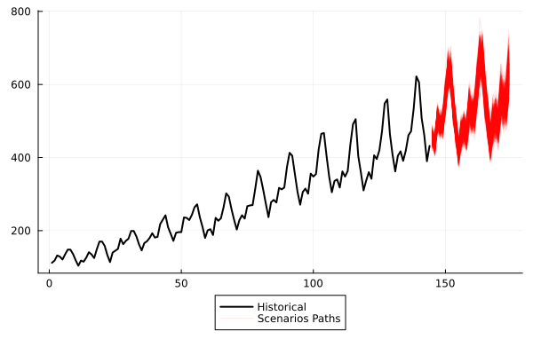
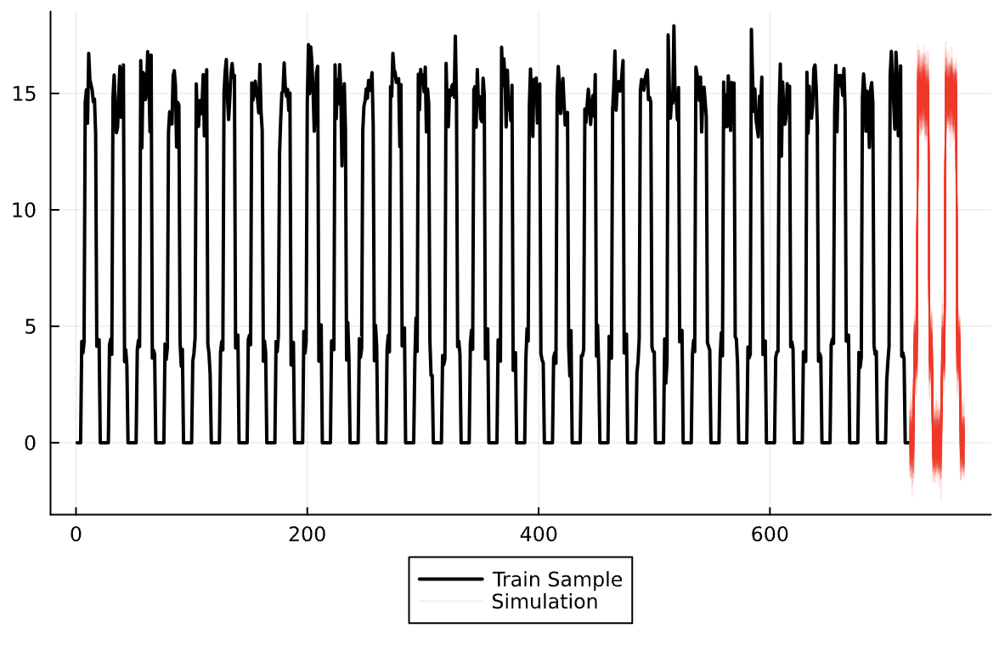

# Examples 

In this page, we present examples of applications and use cases for the package.

## Univariate Forecast

Here we forecast the US airline passengers from 1949 to 1960.

```julia
using CSV, DataFrames, Plots, StateSpaceLearning

airp = CSV.File(StateSpaceLearning.AIR_PASSENGERS) |> DataFrame
log_air_passengers = log.(airp.passengers)
T = length(log_air_passengers)
steps_ahead = 30

model = StructuralModel(log_air_passengers)
fit!(model)
prediction_log = StateSpaceLearning.forecast(model, steps_ahead) # arguments are the output of the fitted model and number of steps ahead the user wants to forecast
prediction = exp.(prediction_log)

plot_point_forecast(airp.passengers, prediction)
```


```julia
N_scenarios = 1000
simulation = StateSpaceLearning.simulate(model, steps_ahead, N_scenarios) # arguments are the output of the fitted model, number of steps ahead the user wants to forecast and number of scenario paths

plot_scenarios(airp.passengers, exp.(simulation))

```


## Forecasting intermittent series

The ``StateSpaceLearning.jl`` package offers a convenient approach for managing intermittent series. Within the ``simulate`` function, the ``seasonal\_innovation\_simulation`` hyperparameter can be configured to ensure that the variability in the simulations also exhibits a seasonal pattern.

We first execute the code with the default parameters to highlight the importance of adapting the model to handle this type of time series effectively:

```julia
using CSV, DataFrames, Plots, StateSpaceLearning

solars = CSV.File(StateSpaceLearning.ARTIFICIAL_SOLARS) |> DataFrame
y = solars[!, "y1"]
T = length(y)
steps_ahead = 48

model = StructuralModel(y; freq_seasonal=24, trend=false, level=false)
fit!(model; penalize_initial_states=false)
simulation = StateSpaceLearning.simulate(model, steps_ahead, 100) #Gets a 12 steps ahead prediction
plot_scenarios(y, simulation)
```


Now we present the results by setting the ``seasonal\_innovation\_simulation`` hyperparameter to 24 (given that it is a solar hourly time series).

```julia
using CSV, DataFrames, Plots, StateSpaceLearning

solars = CSV.File(StateSpaceLearning.ARTIFICIAL_SOLARS) |> DataFrame
y = solars[!, "y1"]
T = length(y)
steps_ahead = 48

model = StructuralModel(y; freq_seasonal=24, trend=false, level=false)
fit!(model; penalize_initial_states=false)
simulation = StateSpaceLearning.simulate(model, steps_ahead, 100; seasonal_innovation_simulation=24) #Gets a 12 steps ahead prediction
plot_scenarios(y, simulation)
```


Thus, the model has demonstrated its capability to effectively capture the intermittent nature of the solar time series, providing a more accurate representation of its underlying characteristics.

## Forecasting with Multiple Seasonality 

The ``StateSpaceLearning.jl`` package handles multiple seasonality by passing parameter ``freq\_seasonal`` as a vector of Int in the StructuralModel instantiation.

We first execute the code considering a single daily seasonality (``freq\_seasonal``=24) to highlight the importance of adapting the model to handle this type of time series effectively:

```julia
using CSV, DataFrames, Plots, StateSpaceLearning

solars = CSV.File(StateSpaceLearning.HOURLY_M4_EXAMPLE) |> DataFrame
y = solars[!, "values"]
T = length(y)
steps_ahead = 168

model = StructuralModel(y; freq_seasonal=168)
fit!(model)
prediction = StateSpaceLearning.forecast(model, steps_ahead) # arguments are the output of the fitted model and number of steps ahead the user wants to forecast

plot_point_forecast(y, prediction)
```


Note that the model successfully captured the daily seasonality but, as expected, was unable to capture the weekly seasonality. We now present the results after setting the `freq\_seasonal` hyperparameter to [24, 168], accounting for both daily and weekly seasonalities.


```julia
using CSV, DataFrames, Plots, StateSpaceLearning

solars = CSV.File(StateSpaceLearning.HOURLY_M4_EXAMPLE) |> DataFrame
y = solars[!, "values"]
T = length(y)
steps_ahead = 168

model = StructuralModel(y; freq_seasonal=[24, 168])
fit!(model)
prediction = StateSpaceLearning.forecast(model, steps_ahead) # arguments are the output of the fitted model and number of steps ahead the user wants to forecast

plot_point_forecast(y, prediction)
```


Note that the model was able to capture both seasonalities in this case.